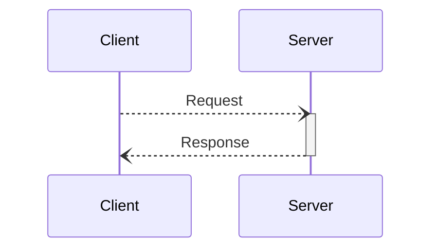
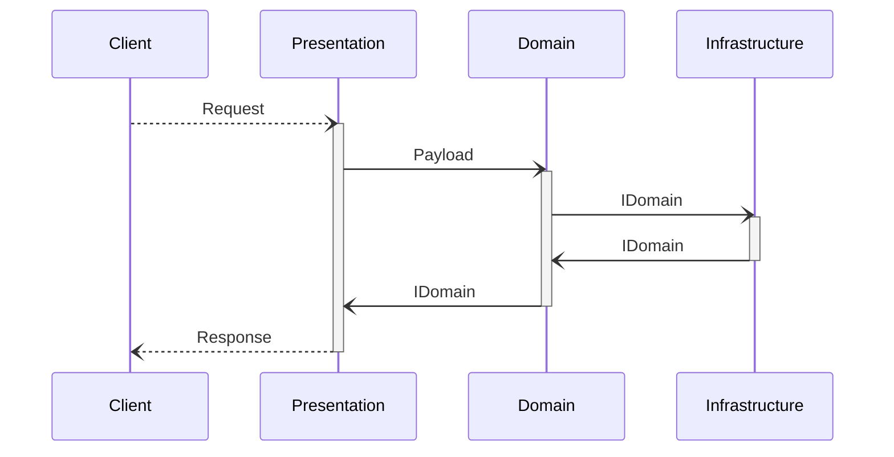

# NExpWS
## Back End

Hecho con:
[](https://github.com/DigiChanges/node-experience)

### **Tabla de Contenidos**
1. [Actores](#actores-)
2. [Fases de los sprints](#fases-de-los-sprints-)
3. [Aspectos funcionales](#aspectos-funcionales-)
4. [Aspectos Tecnicos](#aspectos-tecnicos-)
5. [Primeros Pasos](#primeros-pasos)
6. [Instalación](#instalacion)
7. [Puesta en marcha](#puesta-en-marcha)
8. [Pruebas unitarias](#pruebas-unitarias)

# **ACTORES 👥**

* Roxnny Barrios / Desarrollador Backend / rbarrios@wingsoft.com

## **FASES DE LOS SPRINTS 📅**
- [x] Inicio
- [x] Planificación y estimación
- [x] Desarrollo
- [x] Revisión y restrospectiva
- [x] Entrega

# **ASPECTOS FUNCIONALES 📋**

#### - Objetivo General:


#### - Objetivos Específicos:


#### - A quién va dirigido:

# **ASPECTOS TÉCNICOS 🛠**

Este es un servicio construido monolíticamente con la intención de administrar todas aquellas peticiones salientes desde los clientes definidos haciendo uso de tecnologías vanguardistas que complementan al lenguaje con el que se encuentra construido.

Este servicio se encuentra dividido por diferentes dominios que forman parte de la lógica de negocio:

- App
- Auth
- Crypted
- File
- Log
- Notification
- Role
- User

A demas de dos casos particulares:

- Config
- Shared

### Estructura basica de carpetas para un dominio.
```sh 
├── Domain
│   ├── Entities
│   ├── Exceptions
│   ├── Payloads
│   ├── Services
│   └── UseCases
├── Infrastructure
│   ├── Repositories
│   ├── Schema
│   ├── Services
│   └── Seeds
├── InterfaceAdapters
├── Presentation
│   ├── Commands
│   ├── Controllers
│   ├── Criterias
│   ├── Exceptions
│   ├── Handlers
│   ├── Middlewares
│   ├── Requests
│   └── Transformers
├── Tests
 ```





### Plataforma Tecnológica:
* Tipo de Aplicación: **API REST**
* Framework de Desarrollo: **NExp**
* Servidor de Aplicaciones: **por definir**
* Servidor de Base de Datos: **PostgreSql - MongoDB**
* Lenguaje de Programación: **Node js - Typescript.**
* Arquitectura: **Hexagonal**


# PRIMEROS PASOS

Clonar el repositorio:

```
$ git clone <URL>
```
Configura tu usuario y contraseña y presiona enter. Luego entra a la carpeta ```<FOLDER>```

```sh
cd <FOLDER>
```

# INSTALACION

El servicio require:

1. [Docker](https://www.digitalocean.com/community/tutorials/how-to-install-and-use-docker-on-ubuntu-20-04)
2. [Docker Compose](https://www.digitalocean.com/community/tutorials/how-to-install-and-use-docker-compose-on-ubuntu-20-04)
3. [Lazydocker](https://github.com/jesseduffield/lazydocker)

# PUESTA EN MARCHA

Ejecute el siguiente comando en su terminal de preferencia para inciar en alguno de los siguientes modos.

```bash
# local mode
$ make loc

# development mode
$ make dev

# production mode
$ make prod
```

### Variables de entorno
```sh
# Set to production when deploying to production
NODE_ENV
NODE_PATH

SET_COOKIE_SECURE
SET_COOKIE_SAME_SITE

# Node.js server configuration
SERVER_PORT

# Database configuration
DB_HOST
DB_HOST_MONGO
DB_USER
DB_DATABASE
DB_PASSWORD
DB_PORT
DB_PORT_MONGO
DB_SYNCHRONIZE
DB_TYPE_DEFAULT
# Type only SQL
DB_TYPE

CACHE_HOST
CACHE_PORT
CACHE_PASSWORD

MINIO_HOST
MINIO_ACCESS_KEY
MINIO_SECRET_KEY
MINIO_USE_SSL
MINIO_PORT
MINIO_PUBLIC_BUCKET
MINIO_PRIVATE_BUCKET
MINIO_ROOT_PATH
MINIO_REGION
FILESYSTEM_DEFAULT

TZ

JWT_SECRET
JWT_EXPIRES
JWT_ISS
JWT_AUD

SMTP_HOST
SMTP_PORT
SMTP_USERNAME
SMTP_PASSWORD
SMTP_SECURE_SSL
SMTP_SENDER_NAME
SMTP_SENDER_EMAIL_DEFAULT

URL_API
URL_WEB

AUTHORIZATION

PRODUCT_NAME

ENCRYPTION_DEFAULT

EXECUTE_CRONS

PUSH_PUBLIC_KEY
PUSH_PRIVATE_KEY

LOCALE

SYMMETRIC_KEY
```

# PRUEBAS UNITARIAS

NexpWS usa Jest para correr las pruebas unitarias. Puedes correrlas todas o específicas.

1. Para correrla todas:
    ```bash
    # unit tests
    $ yarn test
    ```

2. Para correr cada una individual:
    ```sh
     # unit tests
     yarn test <PATH_OF_YOUR_ROOT_FOLDER>
    ```
